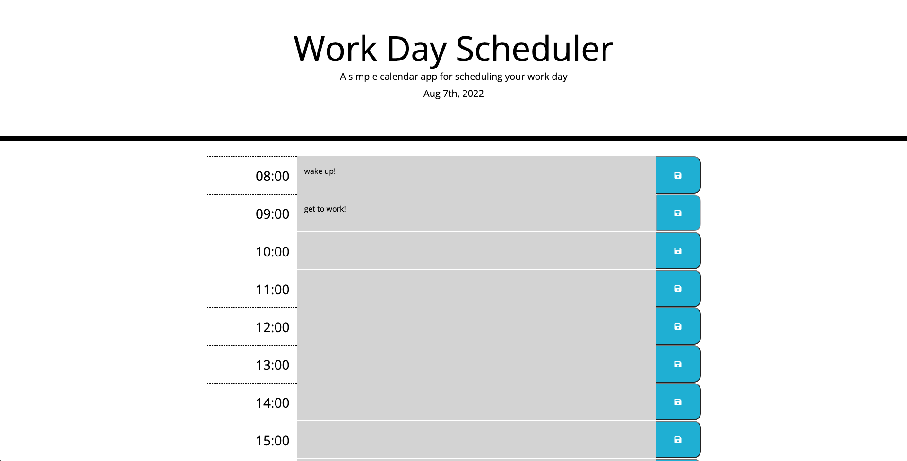

# 05 Third-Party APIs: Work Day Scheduler

## Plan your Workday!

This day scheduler is equiped with:

```
1. The current day displayed at the top of the page.
2. Timeblocks for standard business hours.
3. Color coded backgrounds for each item. (in the past, present, or future, depending on the current time)
4. A text area for the user to create an event
5. The ability to press the save button next to the item to save that event to local storage
6. The event will persist even after the page is reloaded
```

## Mock-up



## Links

Github repository link: https://github.com/BryanBorek/05-Work-Day-Scheduler

Link to deployed site: 